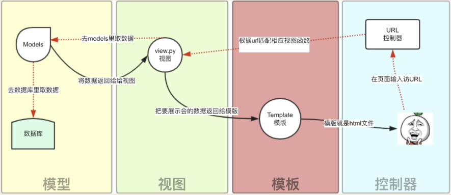

# SD

## 项目环境配置

为了提高项目的跨平台性，便于大家配置环境，我们采用基于Python的后端框架Django和零配置轻量级数据库SQLite。在安装好Python的情况下，只需要运行：

```
> pip install django
```

即可以完成环境的配置

## 项目的运行

打开cmd（或powershell、其他IDE中的终端等均可），将当前目录移动至项目根目录下，输入：

```
> python manage.py runserver
```

如果显示的结果类似

```
Watching for file changes with StatReloader
Performing system checks...

System check identified no issues (0 silenced).

July 27, 2021 - 13:34:45
Django version 3.2.5, using settings 'sd.settings'
Starting development server at http://127.0.0.1:8000/
Quit the server with CTRL-BREAK.
```

则说明运行成功。否则根据打印内容的提示解决相关问题。

打开浏览器，输入：`http://127.0.0.1:8000/` 或 `http://localhost:8000/` 既可以访问网站

## Django 工作原理简述

Django 是基于 MTV 模型的这包括了三个重要部分：

- 模型（Models）
- 模板（Templates）
- 视图（Views)

之间的关系如下图所示：



我们举一个简单的例子：

例如在浏览器中输入 `http://localhost:8000/login` 浏览器就会发送一个 GET 请求到这个地址。其中 `localhost:8000` 就会对应到本地的服务器，也就是由 `runserver` 命令所启动（因此整个过程不能关闭命令行）。服务器收到了 `/login/` 之后，就会交由 URL 控制器解析，根据解析结果寻找相应的视图完成任务。Django 的 URL 控制器其实就是 `.sd/urls.py` 文件（以及其他的`.{app_name}/urls.py`）。

我们看 `urls.py` 中的代码

```python
...

urlpatterns = [

    ...

    path("login/", home.views.login, name="login"),

    ...

]
```

这说明了，对于 `login` ，我们要去找的对应的视图是 `home.views.login`，这其实就是 `.home/views.py` 中的 `login` 函数，（没错，一个视图其实就是 `.{app_name}/views.py` 中的一个函数。），那这个函数又干了什么呢？

```python
def login(request):
    context = {"form": LoginForm()}

    ...

    return render(request, "login.html", context)
```

我们这个返回值的意思是：对于 `login` 函数收到的请求，使用 `login.html` 模板，并将 `context` 数据渲染到模板中。

`login.html` 模板内容如下：

```html
<form action="" method="post">
    
    {{ form }}
    <input type="submit" value="login">
    
    {{ error_msg }}
    
</form>
```

可以看到，模板中混杂了 `HTML` 语法和形如 `{{}}, ` 的语法。后者是 Django 的模板语法。上文 `render()` 函数的作用就是，将根据 Django 模板语法的规则用 `context` 渲染这一模板（大概就是把内容填到对应的地方。）使之成为一个纯粹的 `HTML` 文件，并作为一个 `HTTP` 响应返回给浏览器。

那么模型又是什么？简单的说，模型就是就是编写在 `models.py` 中的一个类，这个类与数据库中的表是直接对应的。在本项目中，我们统一放在了data这一应用之下。例如 `.data.models.py` 中定义了用于登录的用户类 `User` 

```python
class User(models.Model):
    username = models.CharField(max_length=5, primary_key=True)
    password = models.CharField(max_length=20)
```

 这就与 `SQL` 语句

```sql
CREATE TABLE(
    username VARCHAR(5) PRIMARY KEY,
    password VARCHAR(2O)
)
```

是对应的。使用模型的话，相应的 `SQL` 语句会自动生成。这种设计被称作对象关系映射（ORM）

## 数据交互

## 与数据库的数据交互

与数据库的数据交互采用上文所述的基于ORM的模型方法，具体可以参考文档

[Django文档：执行查询](https://docs.djangoproject.com/zh-hans/3.2/topics/db/queries/)

## 与前端的交互

### 后端传数据给前端

与前端的交互采用上文所述的基于模板的方法。后端传递给前端的数据可以直接用模板的语法表示成相应的 `{{ variable }}`，并在视图中使用上下文管理 `context = {"variable":<variable_value>}` 传输数据

### 前端传数据给后端

前端传递给后端的数据则采用表单的POST请求，例如如下表单（与 HTML 中表单语法几乎一样）

```html
<form action="" method="post">
<input type="text" name="username" , value="{{ username }}">
<input type="text" name="password" , value="{{ password }}">
<input type="submit" value="登录">
</form>
```

就会显示为两个文本框和一个按钮。在浏览器中按下按钮后，浏览器jiu就会向服务器提交一个POST请求，同时等待相应结果刷新页面。

此时的视图函数

```python
def login(request):
    context = {}

    if request.method == "POST": # 如果浏览器提交的是 POST 请求（输入url访问为GET请求））
        
        # 通过 request.POST 可以得到 POST 请求传输的数据

        if ...  # 如果账号密码正确
            return redirect(reverse("index"))  # 跳转主页
        else:  # 否则
            ... # 不跳转

    return render(request, "login.html", context)
```

### Django 中的表单类

Django 中提供了表单类用于统一以上过程

例如在 `home/forms.py` 中编写

```python
from django import forms

class LoginForm(forms.Form):
    username = forms.CharField(name="username")
    password = forms.CharField(name="password", widget=forms.PasswordInput)
```

就完成了登录的表单类。

表单类的一个好处是模型表单类，也就是基于已经创建的模型创建表单，比如上述代码可以写作（项目现在的代码）：

```python
from django import forms
from data.models import User


class LoginForm(forms.ModelForm):
    class Meta:
        model = User
        fields = "__all__"

```

此时视图和模板中的代码可以写为

```python
def login(request):
    context = {"form": LoginForm()}

    if request.method == "POST":
        form = LoginForm(request.POST)

        if form.is_valid():
            if User.objects.filter(**form.cleaned_data).exists():  # 如果能够在数据库中找到记录
                return redirect(reverse("index"))  # 跳转主页
            else:
                context.update(
                    {
                        "is_error": True,
                        "error_msg": "用户名或密码错误",
                    }
                )
        else:
            context.update(
                {
                    "is_error": True,
                    "error_msg": "格式错误",
                }
            )

    return render(request, "login.html", context)
```